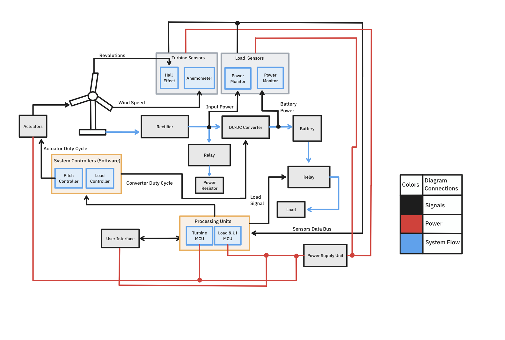
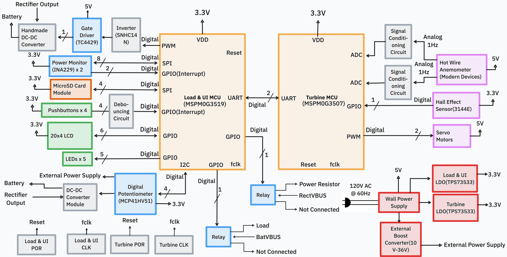
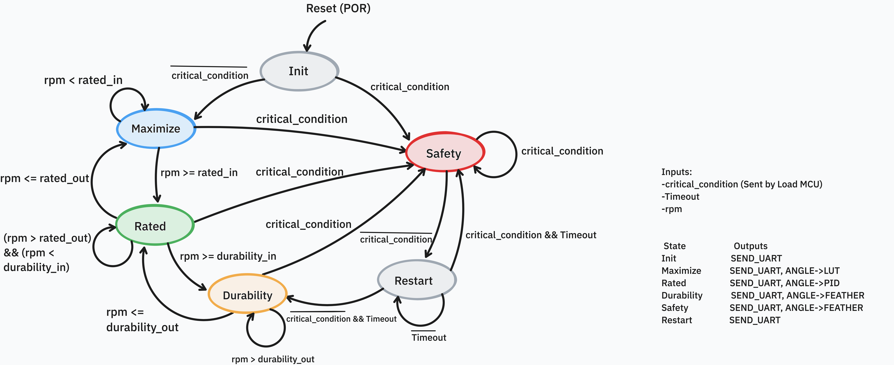
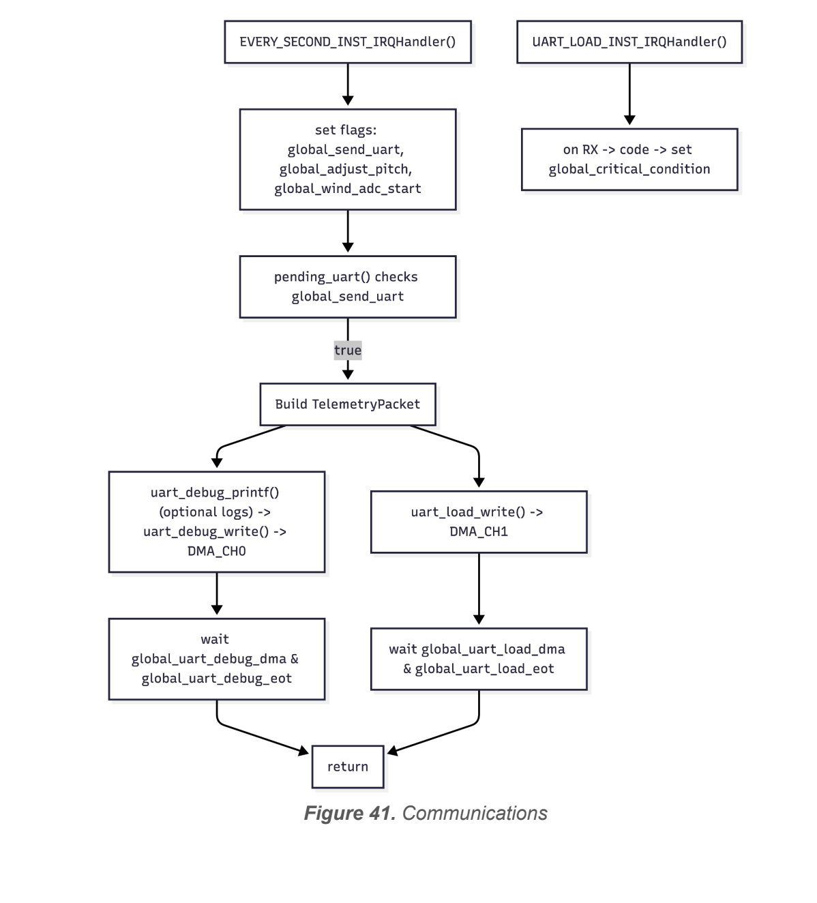
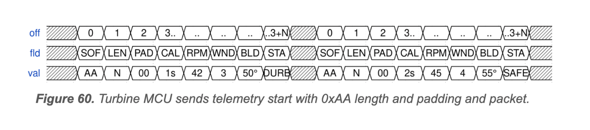

# Horizontal Axis Wind Turbine Electronic Control Unit (ECU)

## Turbine MCU Firmware

Embedded firmware for the **Turbine Microcontroller Unit (MCU)** of the **Horizontal Axis Wind Turbine Electronic Control Unit (ECU)**.

This repository contains the firmware responsible for the real-time operation of the wind turbine, including turbine monitoring, blade pitch control, state management, and communication with the Load & UI MCU.

---

# Documentation & Demo

| Resource | Link |
| ------------------------ | ------------------------------- |
| 🎥 Project Demonstration | https://www.youtube.com/watch?v=vS5Ok38P1Jk |
| 📄 Final Project Report | https://drive.google.com/file/d/1cckKhvj7mvzCEbm3IqWp0KvrUp9g6mgg/view?usp=sharing |
| 📚 Technical Appendix | https://drive.google.com/file/d/1xu7MtcffDlpna8_BUkwEc_BfjpQJpUep/view?usp=sharing |

---

# Overview

The Horizontal Axis Wind Turbine Electronic Control Unit (ECU) was developed for the AeroPower research team at the University of Puerto Rico – Mayagüez to provide a complete embedded control solution for a laboratory-scale wind turbine.

The ECU is divided into two independent embedded systems:

- **Turbine MCU** *(this repository)*
- **Load & UI MCU**

The Turbine MCU is dedicated to time-critical tasks such as sensing, blade pitch control, and turbine state supervision, while the Load & UI MCU independently manages battery charging, converter control, data logging, user interaction, and electrical protection.

This distributed architecture improves modularity, scalability, and overall system reliability.

<p align="center">
  
</p>

<p align="center">
<b>Figure 1.</b> High-Level Electronic Control Unit Overview
</p>

---

# Engineering Highlights

- Dual-MCU embedded architecture
- Real-time blade pitch control
- Hall-effect rotor speed measurement
- Hot-wire anemometer interface
- PWM servo control
- Finite State Machine (FSM)
- UART communication
- Safety-oriented firmware
- Modular embedded software
- Developed using the Texas Instruments MSPM0 SDK

---

# Features

- Real-time wind speed monitoring
- Rotor RPM measurement
- Blade pitch control using dual servo actuators
- Turbine operating state management
- Critical fault detection
- Emergency blade feathering
- UART communication with the Load & UI MCU
- Modular firmware implementation

---

# Firmware Architecture

The firmware continuously monitors turbine operating conditions and executes the appropriate control strategy through a Finite State Machine.

Its responsibilities include:

- Reading turbine sensors
- Measuring rotor speed
- Computing turbine operating state
- Controlling blade pitch
- Driving servo actuators
- Exchanging information with the Load & UI MCU
- Responding to critical operating conditions

<p align="center">
  
</p>

<p align="center">
<b>Figure 2.</b> Turbine MCU Firmware Architecture
</p>

---

# Turbine State Machine

The controller implements a Finite State Machine to regulate turbine behavior under varying operating conditions.

States include:

- Initialization
- Maximum Power
- Rated Operation
- Durability Mode
- Safety Mode
- Restart

State transitions are determined by:

- Rotor speed
- Critical system conditions
- Safety requests
- Timeout events

Whenever a hazardous operating condition is detected, the controller enters the Safety state and commands the blades toward the feather position to reduce aerodynamic torque.

<p align="center">
  
</p>

<p align="center">
<b>Figure 3.</b> Turbine Operating State Machine
</p>

---

# Communication

The Turbine MCU exchanges information with the Load & UI MCU through a UART interface.

### Transmitted Data

- Rotor RPM
- Wind speed
- Turbine operating state
- Blade angle
- Fault status

### Received Commands

- Critical shutdown requests
- Safety synchronization
- Operating commands

This communication enables coordinated mechanical and electrical control of the complete wind turbine system.

<p align="center">
  
</p>

<p align="center">
<b>Figure 4.</b> Communication Architecture Between Both MCUs
</p>

<br>

<p align="center">
  
</p>

<p align="center">
<b>Figure 5.</b> UART Communication Datagram
</p>

---

# Development Environment

## Hardware

- Texas Instruments MSPM0G3507
- Hall-effect sensor
- Hot-wire anemometer
- Dual servo actuators

## Software

- C
- Code Composer Studio (CCS)
- TI MSPM0 SDK
- SysConfig

---

# Repository Structure

```text
HAWT-TurbineMCU-Firmware
│
├── LICENSE                 Project license
├── README.md               Repository documentation
├── images/                 Repository figures
├── turbine.c               Main Turbine MCU firmware implementation
├── turbine.syscfg          TI SysConfig project configuration
├── ccsproject.txt          CCS project configuration
├── cproject.txt            Eclipse CDT project configuration
└── gitignore.txt           Git ignore configuration
```

---

# Related Repositories

| Repository | Description |
| ------------------------ | -------------------------------------------------------------- |
| HAWT-LoadUI-Firmware | Firmware for battery charging, power management, UI, and data logging |
| HAWT-TurbineMCU-PCB | PCB design for the Turbine MCU |
| HAWT-LoadUI-PCB | PCB design for the Load & UI MCU |

---

# Authors

- Hiram R. Rodríguez Hernández
- José M. Burgos Guntín
- Sergio A. Meléndez Padilla
- Sergio A. Da Silva López

Department of Electrical & Computer Engineering

University of Puerto Rico – Mayagüez

---

# License

This project was developed for educational and research purposes as part of the Embedded Systems Design course at the University of Puerto Rico – Mayagüez.
